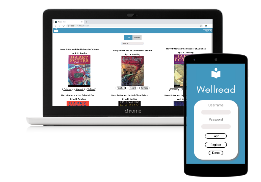

# Wellread

Live App: https://wellread.lancebryanrussell.now.sh/
Client Repo: https://github.com/lrussell13/wellread

## About

Wellread is an app that helps readers feel like they are upgrading their lives with every finished book. Users can track their reading habits and feel rewarded by progressing through a level based system. 

## Technologies Used:
* React
* CSS
* Node
* Express
* PostgreSQL
* Api:
    * OpenLibrary

